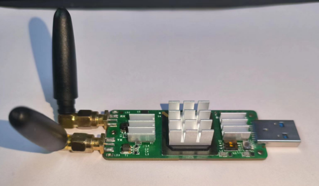

# SnowRadio Nano

SnowRadio Nano is a very small SDR based on Ettus USRP B200mini.

 

## Hardware

* Wide frequency range: 70 MHz – 6 GHz
* Up to 56 MHz of instantaneous bandwidth
* Full duplex operation
* User-programmable Xilinx Spartan-6 XC6SLX75 FPGA
* Fast and convenient bus-powered USB 3.0 connectivity
* GPIO and JTAG for control and debug capabilities

## FPGA Images

Because of the FPGA footprint, official ettus fpga images can not be used!

* uhd-4.3.0.0(Latest)
* uhd-4.1.0.5
* uhd-3.15.0.0(LTS)
* uhd-3.10.3.0

## Software

### 1.UHD

* uhd-4.1.0.5(Latest)
* uhd-4.0.0.0
* uhd-3.15.0.0(LTS)
* uhd-3.10.3.0

### 2.Gnuradio

* Gnuradio-3.8 for Windows (uhd-4.0.0.0)
* Gnuradio-3.9 for Linux (uhd-4.1.0.5 编译安装)

### 3.Gqrx

* Gqrx for Linux (uhd-4.1.0.5 编译安装)
* Gqrx for Linux (uhd-3.10.3.0 官方Appimage) 
* Gqrx for Windows (uhd-4.0.0.0 随gnuradio3.8安装版)

### 4.SDRangel

* SDRangel for Linux (uhd-4.1.0.5 编译安装)
* Sdrangel for Windows (uhd-4.1.0.5 官方安装包)

### 5.Matlab 

* Communication Toolbox for USRP (uhd-3.15.0.0) 

### 6.srsRAN(srsLTE）

* srsRAN 22.04 for LTE （enb+ue）（uhd-4.1.0.5 编译安装）
* srsRAN 22.04 for LTE （enb+cost ue）（uhd-4.1.0.5 编译安装）

